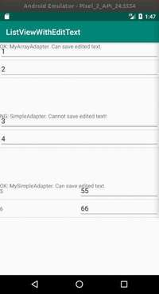

# EditTextInListView

## 概要
参考: [Android: ListView内のEditTextの実装](https://senooken.jp/post/2020/05/11/)

Androidアプリにおける`ListView`内に`EditText`が配置されたウィジェットのサンプルを開発した。

## 実行イメージ
アプリの実行イメージを以下に掲載する。



このアプリでは3の`ListView`が実装されている。

1番目のブロックは`ListView`に`ArrayAdapter`の実装を設定したものとなっており，`ListView`内に`EditText`だけを配置するシンプルな実装となっている。

2番目のブロックは`ListView`に`SimpleAdapter`を設定したものとなっている。`getView`を自分で実装していないため，`EditText`に`TextWatcher`を設定できておらず，**`EditText`への入力内容が維持されないNGなケース**となっている。

3番目のブロックは`ListView`に`SimpleAdapter`の実装を設定したものとなっている。`ArrayAdapter`と異なり`ListView`内に複数のウィジェットを配置した複雑なウィジェットの例となっている。

## 説明
`EditText`を編集可能にするには，`addTextChangedListener`で`TextWatcher`の実装を追加する必要がある。

しかし，`ListView`には動的に生成した`TextView`を格納する都合，`ListView`内に配置した`EditText`に`TextWatcher`を追加する方法がわからなかったので整理した。

手順としては，`ListView#setAdapter`で設定する`Adapter`を自分で実装する。

`Adapter`の実装の中で`getView`がデータ表示の度に呼ばれるので，この中で`EditText`を取得して`TextWatcher`を設定する。

最小限のコードは以下となる。

```
public class MainActivity extends AppCompatActivity {
    @Override
    protected void onCreate(Bundle savedInstanceState) {
        super.onCreate(savedInstanceState);
        setContentView(R.layout.activity_main);

        ListView listView1 = findViewById(R.id.listView1);
        listView1.setAdapter(new MyArrayAdapter(this, new String[]{"1", "2"}));
    }

    private class MyArrayAdapter extends ArrayAdapter<String> {
        final String[] values_;

        MyArrayAdapter(Context context, String[] values) {
            super(context, R.layout.list_item, values);
            values_ = values;
        }

        @Override
        public int getViewTypeCount() {
            return getCount();
        }
        @Override
        public int getItemViewType(int position) {
            return position;
        }

        @NonNull
        @Override
        public View getView(final int position, View convertView, @NonNull ViewGroup parent) {
            if (convertView == null) {
                convertView = getLayoutInflater().inflate(R.layout.list_item, parent, false);
            }
            EditText editText = convertView.findViewById(R.id.edit_text);
            editText.setText(values_[position]);
            editText.addTextChangedListener(new TextWatcher() {
                @Override
                public void beforeTextChanged(CharSequence s, int start, int count, int after) {
                }

                @Override
                public void onTextChanged(CharSequence s, int start, int before, int count) {
                }

                @Override
                public void afterTextChanged(Editable s) {
                    values_[position] = s.toString();
                }
            });
            return convertView;
        }
    }
}
```

なお，このサンプルのように初期状態でListView内にEditTextを複数配置する場合，以下のコードが必要だった。

```
        @Override
        public int getViewTypeCount() {
            return getCount();
        }
        @Override
        public int getItemViewType(int position) {
            return position;
        }
```

詳細は不明なのだが，このコードがないと1個目と2個目の`EditText`に入力した内容が同じになってしまう。
