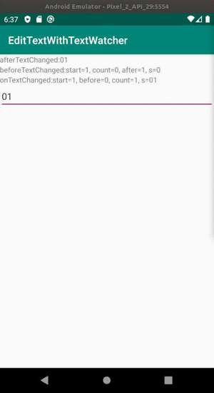

# EditTextWithTextWatcher

参考: [Android: TextWatcherによる編集可能なEditText](https://senooken.jp/post/2020/04/29/)

`EditText` に `TextWatcher` を実装したサンプルを作成した。

`EditText` はテキスト入力のUIとして重宝するが，素の状態だと入力内容の処理には別途 `Button` などのUIと処理が必要だった。

`TextWatcher` を使うことで，入力時に処理を行うことができ，処理の実行に他のUIを必要としない。

アプリの実行イメージを以下に掲載する。

このサンプルでは，`EditText`に入力した内容を，それぞれのコールバックにごとに，引数の内容をTextViewに表示させている。